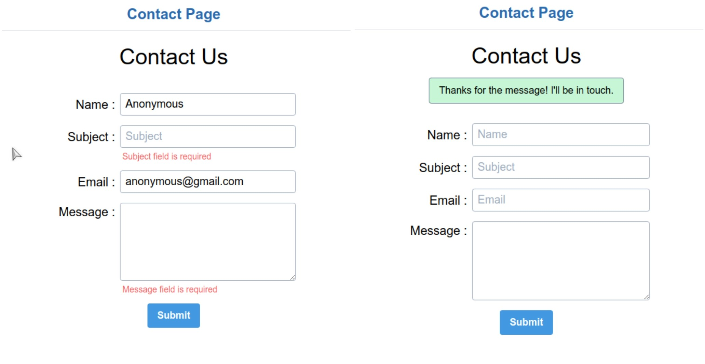

# Node.js Contact Form

Node.js contact form to receive emails from your website. Server-side validation of form with necessary security for HTTP requests and success flash messages is available.



## Details 

This is complete contact form project. It uses Nodemail in conjunction with Mailgun service to handle email delivery through backend. To use this form you need to create account on [Mailgun](https://www.mailgun.com/). Mailgun will provide the api-key and domain which you can add in .env file in project. Then you can simply require the sendMail function from mail.js file from libs folder and start receiving emails. 

__Api-key and domain setup in .env file__

```
create a file ".env" in the root of the folder.
Create two keys API_KEY and DOMAIN.
example:
	API_KEY=your-mailgun-api-key
	DOMAIN=your-mailgun-domain
```


__Commands to run the project on local machine__

```bash
$ npm install
$ npm i -g nodemon #if you don't have nodemon installed globally
$ npm run dev 
```


### Features

- Server-side data sanitization and validation.
- Error display on invalid data submission
- Secured HTTP requests with Helmet.js, csurf.js, sessions and cookies.
- Nodemail and Nodemail-mailgun-transport to send emails.
- Flash Messages on successful submission.


### Technologies

- Node.js and Express.js with EJS template engine
- Nodemail and Nodemail-mailgun-transport packages.
- Mailgun email service
- Tailwind CSS